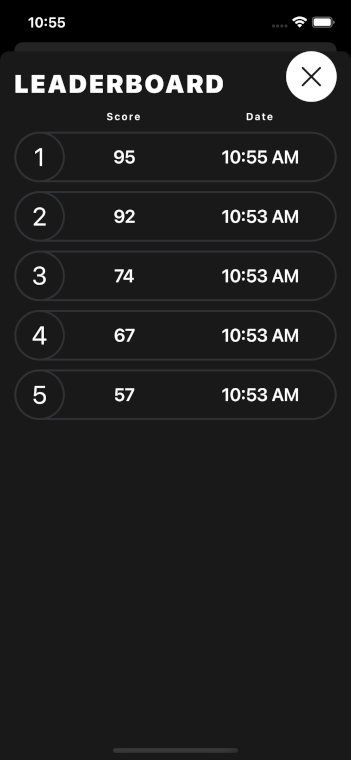

# Week 1

- [x]   [Your First iOS & SwiftUI App: An App From Scratch](https://www.raywenderlich.com/28797163-your-first-ios-swiftui-app-an-app-from-scratch) video course
- [x]  [Your First iOS & SwiftUI App: Polishing the App](https://www.raywenderlich.com/28797859-your-first-ios-swiftui-app-polishing-the-app) video course
- [x]  [Your First iOS & SwiftUI App: Designing the App](https://www.raywenderlich.com/17740710-your-first-ios-and-swiftui-app-designing-the-app-optional) video course
- [x]  [Beginning Git](https://www.raywenderlich.com/4418-beginning-git) video course

## Bull's Eye

An accuracy game where the main aim is to put the bull’s eye, which is on a slider that goes from 1 to 100, as close to a randomly chosen target value as you can.

<!DOCTYPE html>
<html>
<head>
    
</head>
<body>
<table><tr>   
  <td>   
    

       
    

  </td>   
  <td>
    

       
    

  </td>    
</tr>
</table>
</body>
</html>
<!DOCTYPE html>
<html>
  <head>
    <title>Title of the document</title>
    
  </head>
  <body>
    <table>
      <tr>
        <th>Person</th>
        <th>Age</th>
      </tr>
      <tr>
        <td>Ann</td>
        <td>19</td>
      </tr>
      <tr>
        <td>Susie</td>
        <td>22</td>
      </tr>
    </table>
  </body>
</html>

