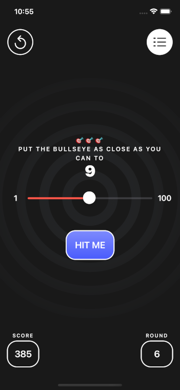

# Week 1

- [x]   [Your First iOS & SwiftUI App: An App From Scratch](https://www.raywenderlich.com/28797163-your-first-ios-swiftui-app-an-app-from-scratch) video course
- [x]  [Your First iOS & SwiftUI App: Polishing the App](https://www.raywenderlich.com/28797859-your-first-ios-swiftui-app-polishing-the-app) video course
- [x]  [Your First iOS & SwiftUI App: Designing the App](https://www.raywenderlich.com/17740710-your-first-ios-and-swiftui-app-designing-the-app-optional) video course
- [x]  [Beginning Git](https://www.raywenderlich.com/4418-beginning-git) video course

## Bull's Eye

An accuracy game where the main aim is to put the bull’s eye, which is on a slider that goes from 1 to 100, as close to a randomly chosen target value as you can.

|||

